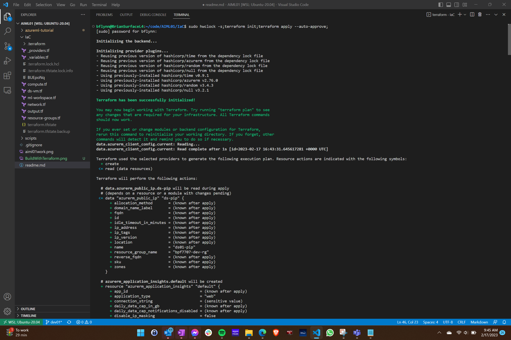
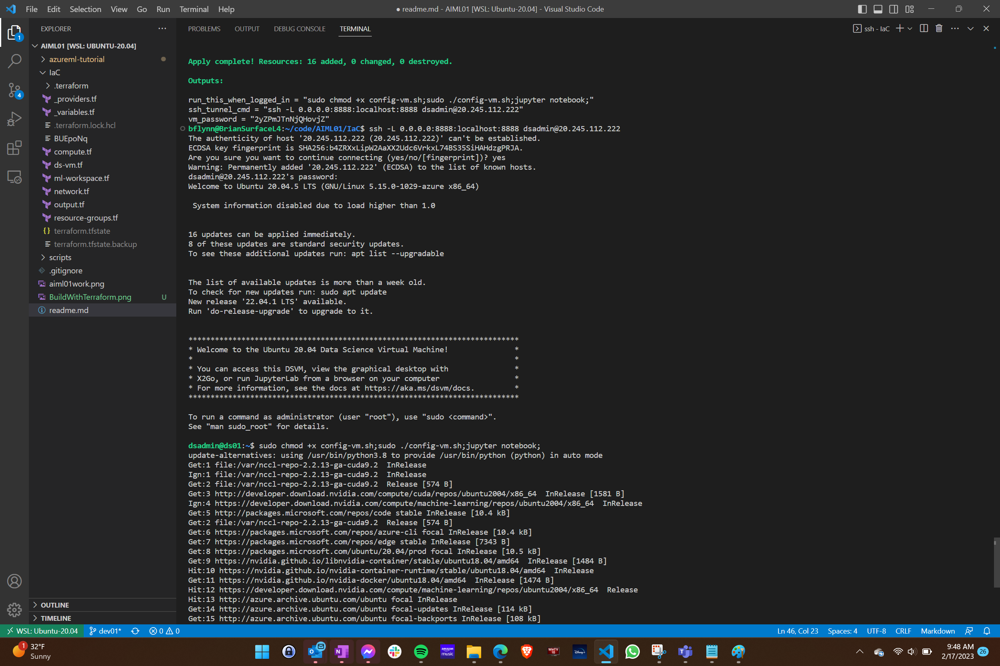
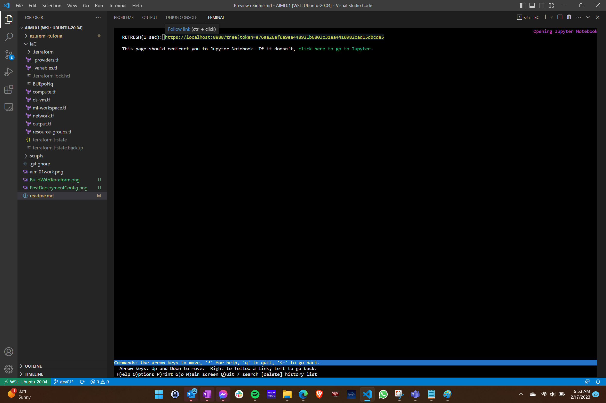
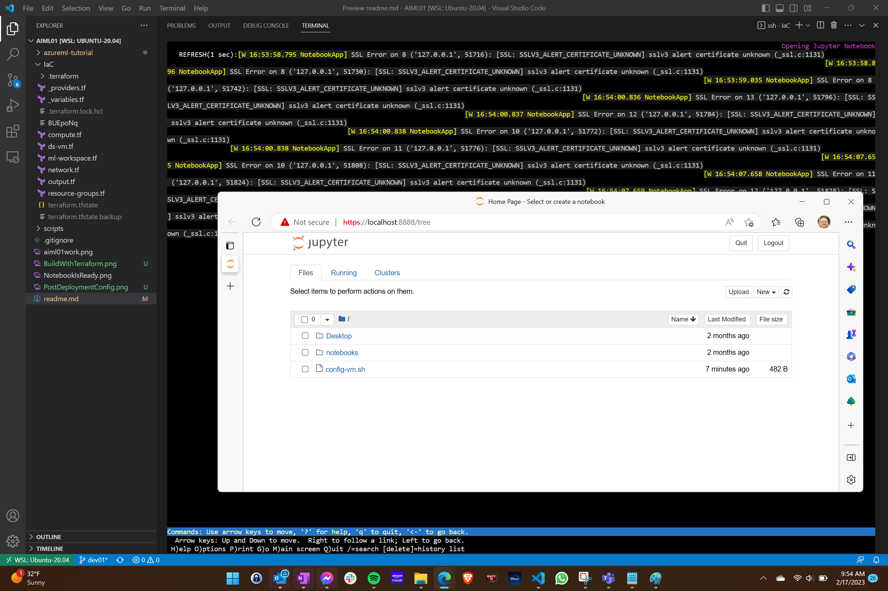

## Must accept product terms
must run from linux prompt: az vm image terms accept --urn microsoft-ads:linux-data-science-vm-ubuntu:linuxdsvmubuntu:latest

## Must create SPA
must run from powershell or linux?:
az ad sp create-for-rbac --name terraform_spa --role Contributor --scopes /subscriptions/xxxxxx--your-sub--xxxxxxx

Then add TF_VAR_Environment variables for setting the variables used in the _providers.tf file.

<ul>
<li>TF_VAR_ARM_SUBSCRIPTION_ID
<li>TF_VAR_ARM_TENANT_ID
<li>TF_VAR_ARM_CLIENT_ID
<li>TF_VAR_ARM_CLIENT_SECRET
</ul>

## Build with Terraform
The IaC directory contains all the terraform. 
 
So.... $ terraform init; terraform apply;

## Fix for auth issues durring provisioning
Error: reading queue properties for AzureRM Storage Account 
queues.Client#GetServiceProperties: Failure responding to request: 
StatusCode=403 -- Original Error: autorest/azure: Service returned an error. 
Status=403 Code="AuthenticationFailed" Message="Server failed to authenticate the request.
 Make sure the value of Authorization header is formed correctly including the signature.

Fix by running this command to adjust the clock: sudo hwclock -s

Consider always running it before apply. 
 
EX: sudo hwclock -s;terraform apply;

-- https://stackoverflow.com/questions/60485712/terraform-and-azure-unable-to-provision-storage-account

## How To Connect to Data Science VM Jupyter Notebook
The terraform output will provide an SSH command like the following.
ex: $ ssh -L 0.0.0.0:8888:localhost:8888 dsadmin@PUBLIC_IP_ADDRESS_FROM_OUTPUT

Run the config-vm.sh script.  You will need to grant permssiosn with chmos +x config-vm.sh
ex: $ chmod +x config-vm.sh;./config-vm.sh;

Then use a browser to connect to the URL it outputs with a unique token

## Build with Terraform
The infrastructure will spin up and provide instructions for configuring the VM.

## Post Deployment Config
The SSH command for logging in, and password are provided.  Also a one line of multiple commands to run that will result in a link to your Jupyter Notebook.

## Your Notebook Is Ready!
Open that link in a browser.  The SSH tunnel you opened, provides access to the notebook.

## Open Your Notebook
When you open the  notebook, the terminal console will show activity.  

