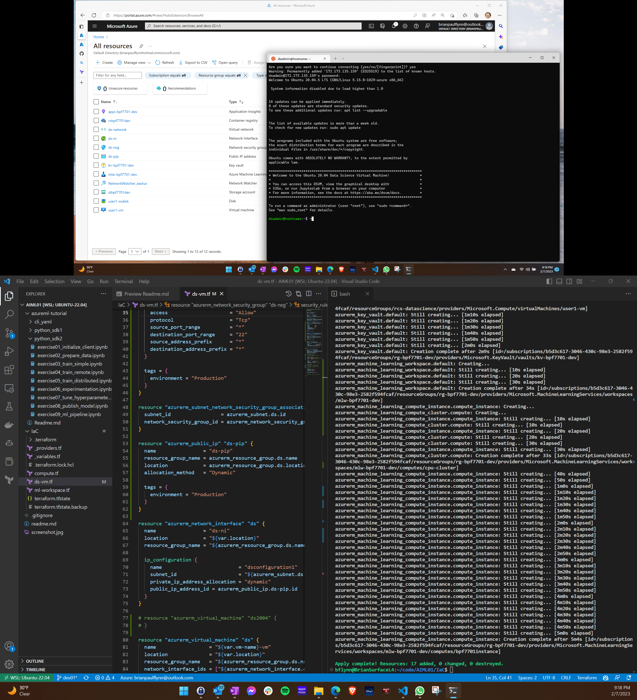

## Must create SPA
must run from powershell or linux?:
az ad sp create-for-rbac --name terraform_spa --role Contributor --scopes /subscriptions/xxxxxxxxxxxxx

Then add TF_VAR_Environment variables for setting the variables used in the _providers.tf file.

<ul>
<li>TF_VAR_ARM_SUBSCRIPTION_ID
<li>TF_VAR_ARM_TENANT_ID
<li>TF_VAR_ARM_CLIENT_ID
<li>TF_VAR_ARM_CLIENT_SECRET
</ul>

## Must accept product terms
must run from linux prompt: az vm image terms accept --urn microsoft-ads:linux-data-science-vm-ubuntu:linuxdsvmubuntu:latest

